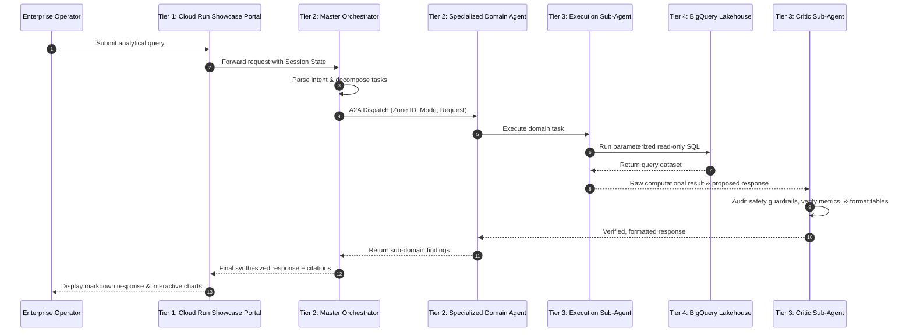

# Enterprise Agents Suite Architecture

## Directory Structure
```text
enterprise-agents-suite/
├── .env                              # Active environment config (Project, Region, Models, Dataset)
├── .env.example                      # Template config with safe defaults
├── agents-cli-manifest.yaml          # Agents-CLI workspace config
├── AGENTS.md                         # Business catalog of all 113 agents, KPIs, BigQuery tables, & models
├── ARCHITECTURE.md                   # System architecture (4-Tier ADK, Security, Data Flow, Portal)
├── GEMINI.md                         # Antigravity/Agent guidance file (coding standards)
├── INSTRUCTION.md                    # Step-by-step deployment runbook for provisioning & hosting
├── Makefile                          # High-level command runners (dev, test, build, web)
├── pyproject.toml                    # Project dependencies (google-adk[gcp]>=2.0.0, FastAPI, etc.)
├── REGISTRATION_GUIDE.md             # Gemini Enterprise registration guide (Workspace Admin & Discovery Engine)
├── table_registry.yaml               # Centralized BigQuery catalog tracking tables per agent (113 agents)
├── Utilities.md                      # Fleet specification, operating principles, and prompt standards
│
├── config/                           # Centralized configuration resolver
│   ├── __init__.py
│   └── settings.py                   # Pydantic Settings reading .env & global models
│
├── agents/                           # 11 Domains Total (1 Master Orchestrator + 10 Industry Sub-Domains)
│   ├── master_orchestrator/          # Global Entry Point & Intent Router (1 agent)
│   │   └── utilities_master_orchestrator/
│   ├── asset_management/             # Power plants, renewables, substations, & DER assets (14 agents)
│   ├── billing_and_invoicing/        # Rate schedules, billing anomalies, & payment reconciliation (11 agents)
│   ├── customer_engagement/          # Omnichannel triage, outage comms, & rate comparison (11 agents)
│   ├── grid_balancing/               # Frequency, inertia, reactive power, & congestion (11 agents)
│   ├── grid_operations/              # Outages, FLISR switching, dispatch, & restoration (11 agents)
│   ├── production_forecasting/       # Solar, wind, hydro, thermal, & load curve prediction (12 agents)
│   ├── regulatory_compliance/        # NERC CIP, OSHA, EPA CEMS, FERC Form 1, & ESG reporting (10 agents)
│   ├── smart_meter_management/       # AMI interval VEE, tamper detection, & ping diagnostics (10 agents)
│   ├── support_services/             # HR union rules, PPA contracts, procurement RFP, & SCADA VPN (10 agents)
│   ├── wholesale_trading/            # Day-ahead/real-time LMP, VaR, spark/dark spreads, & FTRs (12 agents)
│   ├── _template/                    # Standardized agent scaffolding reference
│   │
│   └── <sub_domain>/<agent_name>/    # Standardized Agent Package (All 113 Agents)
│       ├── agent.py                  # Declarative ADK root_agent & dynamic prompt assembly
│       ├── fast_api_app.py           # FastAPI server with telemetry & A2A routing endpoints
│       ├── manifest.yaml             # Agent metadata, tool bindings, table dependencies, & KPIs
│       ├── README.md                 # Detailed technical, business, and evaluation documentation
│       ├── __init__.py               # Exports agent and app symbols
│       ├── config/                   # Local agent configuration & settings
│       │   ├── __init__.py
│       │   └── settings.py
│       ├── instructions/             # Modular prompt layers
│       │   ├── persona.md            # Role, domain context, tone, and identity
│       │   ├── business_rules.md     # Calculation methodologies, thresholds, & domain constraints
│       │   ├── output_format.md      # Structural output directives (Markdown tables, JSON, etc.)
│       │   ├── safety_guardrails.md  # Critical safety, PII protection, & guardrails
│       │   └── sample_prompts.yaml   # Multi-turn enterprise prompts & test scenarios
│       ├── tools/                    # ADK Python Tool Functions
│       │   ├── bigquery_tool.py      # Read-only, parameterized BigQuery SQL executor
│       │   ├── search_tool.py        # Google Search Grounding for live external intelligence
│       │   ├── visualizer.py         # Matplotlib dynamic chart generator
│       │   └── delegation_tool.py    # Agent-to-Agent (A2A) protocol dispatcher
│       ├── sub_agents/               # Task Lead Pattern Sub-Agents
│       │   ├── execution_agent.py    # Analytical execution worker
│       │   └── critic_agent.py       # Independent evaluator & safety gatekeeper
│       ├── app_utils/                # Session state management & shared utilities
│       ├── synthetic_data/           # Data assets for testing and lakehouse seeding
│       │   ├── schema.sql            # BigQuery DDL table definitions
│       │   ├── seed_data.sql         # Seed records for BigQuery table loading
│       │   └── mock_records.csv      # Local CSV fixture data
│       └── tests/                    # Official Google ADK Test & Evaluation Suite
│           ├── eval/
│           │   ├── datasets/
│           │   │   └── golden-dataset.json  # 4-Tier stratified evaluation dataset
│           │   └── eval_config.yaml  # Metric thresholds & evaluator configuration
│           ├── integration/
│           │   └── test_agent.py     # End-to-end multi-turn integration tests
│           └── unit/
│               └── test_tools.py     # Deterministic unit tests for tools & SQL guardrails
│
├── scripts/                          # Automated Provisioning, Testing, & Deployment Pipeline
│   ├── build_catalog_json.py         # Compiles web/catalog.json from all 113 agent manifests
│   ├── deploy_agent_engine.py        # Deploys individual agent to Vertex AI Reasoning Engine
│   ├── deploy_all_and_register.py    # Fleet deploy to Vertex AI Reasoning Engine & GE registration
│   ├── deploy_web_portal.py          # Cloud Build & Cloud Run deploy with GCS video sync & streaming
│   ├── generate_demo_html.py         # Compiles standalone HTML showcase players (dual streaming)
│   ├── generate_demo_video.py        # Wrapper pipeline for video generation
│   ├── generate_web_portal.py        # Compiles single-page catalog index.html with filters & modals
│   ├── live_agent_portfolio_tester.py # Validates live multi-turn interactions against deployed agents
│   ├── load_bq_data.py               # Creates BigQuery datasets, tables, & loads synthetic seed data
│   ├── prompt_parser.py              # Parses modular prompt files into conversation turns
│   ├── prompts_generator.py          # Generates diverse, realistic enterprise prompt scenarios
│   ├── record_agent_demo.py          # Playwright + FFmpeg headless browser 1080p MP4 recorder
│   ├── register_to_gemini_enterprise.py # Registers Reasoning Engines in Discovery Engine API
│   ├── scaffold_agent.py             # Scaffolds new agents from agents/_template
│   ├── setup_iam_permissions.py      # Creates service accounts & grants BigQuery least-privilege IAM
│   ├── sync_diverse_prompts_and_eval.py # Synchronizes multi-turn prompts to golden eval sets
│   └── sync_eval_and_readme.py       # Synchronizes evaluation benchmark metrics into agent READMEs
│
├── demos/                            # Local 1080p MP4 demo videos & standalone showcase HTML players
│   └── <sub_domain>/
│       ├── <agent_name>.mp4          # 1080p MP4 recording synced to GCS
│       └── <agent_name>.html         # Standalone HTML player with dual-streaming sources
│
└── web/                              # Showcase Web Portal (Deployed to Cloud Run)
    ├── index.html                    # Single-page interactive catalog application
    ├── catalog.json                  # Metadata for all 113 agents consumed by the frontend
    ├── readmes/                      # All 113 markdown specification files served inline
    │   └── <sub_domain>/
    │       └── <agent_name>.md       # Native markdown spec served with text/markdown Content-Type
    └── demos/                        # High-performance local demo assets bundled in container
        └── <sub_domain>/
            ├── <agent_name>.html     # In-portal demo player
            └── <agent_name>.mp4      # Same-origin MP4 video streamed via HTTP 206 range requests
```

---

## 4-Tier Google ADK Enterprise Architecture

The Enterprise Agents Suite relies on a robust, secure, and scalable 4-tier architecture using Google Cloud services.

```
┌─────────────────────────────────────────────────────────────────────────────┐
│                        TIER 1: EXPERIENCE LAYER                            │
│  ┌───────────────────────┐ ┌──────────────────────────────────────────────┐ │
│  │   Gemini Enterprise   │ │     Web Showcase Portal (Cloud Run + IAP)    │ │
│  │    (Workspace App)    │ │  - Interactive Catalog (113 Agents)          │ │
│  │   - Dedicated Personas│ │  - Same-Origin HTTP 206 Video Streaming      │ │
│  │   - Direct Routing    │ │  - Inline Markdown Spec Viewer (/readmes/)    │ │
│  └───────────┬───────────┘ └──────────────────────┬───────────────────────┘ │
└──────────────┼────────────────────────────────────┼─────────────────────────┘
               │                                    │
┌──────────────┼────────────────────────────────────┼─────────────────────────┐
│              ▼                                    │                         │
│  ┌────────────────────────────────────────────────┴──────────────────────┐  │
│  │                      TIER 2: AGENT ORCHESTRATION                      │  │
│  │       Vertex AI Reasoning Engine (us-central1, Gemini 3.7 Flash)       │  │
│  │                                                                       │  │
│  │  ┌─────────────────────────────────────────────────────────────────┐  │  │
│  │  │ Utilities Master Orchestrator (Intent Routing & Decomposition)  │  │  │
│  │  └────────────────────────────────┬────────────────────────────────┘  │  │
│  │                                   │ A2A Protocol                      │  │
│  │                                   ▼                                   │  │
│  │  ┌─────────────────────────────────────────────────────────────────┐  │  │
│  │  │ Specialized Domain Agent (Task Lead Pattern)                    │  │  │
│  │  │ - Modular Prompt Layers (Persona, Rules, Safety, Output)        │  │  │
│  │  │ - UtilitiesSessionState (Grid Zone, Alert Level, Mode)          │  │  │
│  │  └────────────────────────────────┬────────────────────────────────┘  │  │
│  └───────────────────────────────────┼───────────────────────────────────┘  │
└──────────────────────────────────────┼──────────────────────────────────────┘
                                       │
┌──────────────────────────────────────┼──────────────────────────────────────┐
│                                      ▼                                      │
│  ┌───────────────────────────────────────────────────────────────────────┐  │
│  │               TIER 3: SPECIALIST SUB-AGENTS & TOOLS                   │  │
│  │                                                                       │  │
│  │  ┌───────────────────────────────┐ ┌───────────────────────────────┐  │  │
│  │  │     Execution Sub-Agent       │ │      Critic Sub-Agent         │  │  │
│  │  │  - Quantitative SQL Synthesis │ │  - Hallucination Gatekeeper   │  │  │
│  │  │  - Scenario Simulation        │ │  - Safety Guardrails Check    │  │  │
│  │  │  - Real-time Computation      │ │  - Markdown Table Formatter   │  │  │
│  │  └───────────────┬───────────────┘ └───────────────▲───────────────┘  │  │
│  │                  │                                 │                  │  │
│  │                  ▼                                 │                  │  │
│  │  ┌─────────────────────────────────────────────────┴───────────────┐  │  │
│  │  │ Tools: BigQuery Tool | Google Search Grounding | Visualizer Tool │  │  │
│  │  └───────────────────────────────┬─────────────────────────────────┘  │  │
│  └──────────────────────────────────┼────────────────────────────────────┘  │
└─────────────────────────────────────┼───────────────────────────────────────┘
                                      │
┌─────────────────────────────────────┼───────────────────────────────────────┐
│                                     ▼                                       │
│  ┌───────────────────────────────────────────────────────────────────────┐  │
│  │               TIER 4: DATA & LAKEHOUSE LAYER (BIGQUERY)               │  │
│  │  - 113 Partitioned & Clustered Datasets (table_registry.yaml)         │  │
│  │  - Least-Privilege Per-Agent IAM Service Accounts                     │  │
│  │  - Synthetic Historical Telemetry, SCADA, AMI, & Grid State Tables    │  │
│  └───────────────────────────────────────────────────────────────────────┘  │
└─────────────────────────────────────────────────────────────────────────────┘
```

### Tier 1: Experience Layer
- **Gemini Enterprise (GE) Workspace App**: Direct conversational UI integrated into Google Workspace, enabling utility dispatchers, engineers, and financial analysts to chat with agents using natural language.
- **Web Showcase Portal (Cloud Run - `utilities-agents-portal`)**: High-performance single-page catalog hosted in `us-central1` and secured by Google Cloud Identity-Aware Proxy (IAP). Allows enterprise stakeholders to search, filter by subdomain, inspect agent specifications, and watch HD demonstration videos.
- **Dual-Streaming Video Architecture**:
  - **Primary (Same-Origin Cloud Run Streaming):** All 113 demo MP4 video files are bundled directly into the Cloud Run container via Cloud Build from `gs://utilities-agents-demos/`. Nginx is tuned with `sendfile on;`, `tcp_nopush on;`, and `Accept-Ranges: bytes`, enabling instant HTTP 206 Partial Content scrubbing and streaming behind IAP for `@google.com` and authorized domain users with zero cross-origin friction.
  - **Fallback / External GCS Console Link:** Each demo page includes a direct authenticated GCS console fallback (`https://storage.cloud.google.com/utilities-agents-demos/<domain>/<agent>.mp4`) with domain-level permissions (`domain:google.com`, `allAuthenticatedUsers`) and CORS enabled.
- **Native Markdown Specification Viewer (`/readmes/`)**: All 113 agent READMEs are hosted on Cloud Run under `web/readmes/<subdomain>/<agent>.md` with explicit `Content-Type: text/markdown; charset=utf-8` headers, rendering cleanly inline without triggering binary downloads.

### Tier 2: Agent Orchestration Layer
- **Google ADK `root_agent`**: Autonomous multi-turn reasoning engine powered by `gemini-3.7-flash` (with `gemini-3.1-pro` available for complex reasoning) deployed on **Vertex AI Agent Engine (Reasoning Engine)** in `us-central1`.
- **Master Orchestrator Pattern (`utilities_master_orchestrator`)**: Single pane of glass handling universal intent classification, multi-domain task decomposition, and dynamic routing to specialized domain agents via the Agent-to-Agent (A2A) protocol.
- **Shared Session State Machine (`UtilitiesSessionState`)**: Passes contextual state across the A2A chain, including `customer_id`, `grid_zone_id`, `operating_mode` (Normal/Emergency), and `alert_level`.
- **Observability & Telemetry**: Cloud Trace distributed tracing, OpenTelemetry spans, and structured audit logs tracking query execution, token usage, and latency.

### Tier 3: Specialist Sub-Agents & Tools
- **Task Lead Pattern (Worker + Critic)**:
  - **Execution Sub-Agent (`execution_agent.py`)**: Translates user intent into domain calculations, executes read-only BigQuery SQL, and performs simulations.
  - **Critic Sub-Agent (`critic_agent.py`)**: Intercepts execution output, rigorously audits against `safety_guardrails.md`, checks for hallucinated metrics, strips private internal reasoning logs, enforces markdown table formatting, and verifies compliance before responding.
- **Tools**:
  - **`BigQueryTool` (`bigquery_tool.py`)**: Parameterized, read-only SQL query execution with strict regex guardrails blocking mutative statements (`DROP`, `DELETE`, `INSERT`, `ALTER`, `TRUNCATE`).
  - **`SearchTool` (`search_tool.py`)**: Google Search Grounding for live energy regulatory updates (FERC, NERC, PUC), market prices, and weather forecasts.
  - **`VisualizerTool` (`visualizer.py`)**: Matplotlib dynamic chart generator creating data visualizations.
  - **`DelegationTool` (`delegation_tool.py`)**: Dispatches sub-tasks to downstream agents across sub-domains.

### Tier 4: Data & Enterprise Lakehouse Layer
- **BigQuery Lakehouse**: Segregated datasets and 113 partitioned analytical tables tracked in `table_registry.yaml`.
- **Least-Privilege Security**: Dedicated service account per agent (`<agent_id>@<project>.iam.gserviceaccount.com`) granted strictly `roles/bigquery.dataViewer` and `roles/bigquery.jobUser`.
- **Synthetic Data Pipeline**: Comprehensive schema DDL (`schema.sql`), mock CSVs (`mock_records.csv`), and automated loading scripts (`load_bq_data.py`).

---

## Architectural Sequence Diagram: Multi-Turn Query Lifecycle



---

## Modular Prompt Composition Pattern

Every agent in the fleet dynamically compiles its system instructions at runtime from modular prompt layers:

1. **`persona.md`**: Defines professional persona, role, tone, and operational boundaries (e.g., senior transmission engineer, billing specialist).
2. **`business_rules.md`**: Enforces industry-standard formulas, operating limits, and calculation methodologies (e.g., IEEE standards, NERC reliability criteria, LMP settlement rules).
3. **`output_format.md`**: Standardizes visual presentation, requiring structured Markdown tables, executive summaries, and actionable recommendations.
4. **`safety_guardrails.md`**: Strict security guardrails preventing prompt injection, PII disclosure, unauthorized grid state modification, and non-read-only SQL operations.
