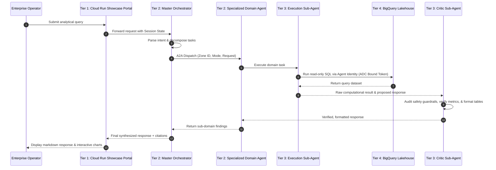

# Enterprise Agents Suite Architecture

## Directory Structure
```text
enterprise-agents-suite/
├── .env                              # Active environment config (Project, Region, Models, Dataset)
├── .env.example                      # Template config with safe defaults
├── agents-cli-manifest.yaml          # Agents-CLI workspace config
├── AGENTS.md                         # Business catalog of all 113 agents, KPIs, BigQuery tables, & models
├── ARCHITECTURE.md                   # System architecture (4-Tier ADK, Security, Data Flow, Portal)
├── GEMINI.md                         # Antigravity/Agent guidance file (coding standards)
├── INSTRUCTION.md                    # Step-by-step deployment runbook for provisioning & hosting
├── Makefile                          # High-level command runners (dev, test, build, web)
├── pyproject.toml                    # Project dependencies (google-adk[gcp]>=2.0.0, FastAPI, etc.)
├── REGISTRATION_GUIDE.md             # Gemini Enterprise registration guide (Workspace Admin & Discovery Engine)
├── table_registry.yaml               # Centralized BigQuery catalog tracking tables per agent (113 agents)
├── Utilities.md                      # Fleet specification, operating principles, and prompt standards
│
├── config/                           # Centralized configuration resolver
│   ├── __init__.py
│   └── settings.py                   # Pydantic Settings reading .env & global models
│
├── agents/                           # 10 Business Domains + 1 Master Orchestrator (113 Agents Total)
│   ├── master_orchestrator/          # Global Entry Point & Intent Router (1 agent)
│   │   └── utilities_master_orchestrator/
│   ├── asset_management/             # Power plants, renewables, substations, & DER assets (14 agents)
│   ├── billing_and_invoicing/        # Rate schedules, billing anomalies, & payment reconciliation (11 agents)
│   ├── customer_engagement/          # Omnichannel triage, outage comms, & rate comparison (11 agents)
│   ├── grid_balancing/               # Frequency, inertia, reactive power, & congestion (11 agents)
│   ├── grid_operations/              # Outages, FLISR switching, dispatch, & restoration (11 agents)
│   ├── production_forecasting/       # Solar, wind, hydro, thermal, & load curve prediction (12 agents)
│   ├── regulatory_compliance/        # NERC CIP, OSHA, EPA CEMS, FERC Form 1, & ESG reporting (10 agents)
│   ├── smart_meter_management/       # AMI interval VEE, tamper detection, & ping diagnostics (10 agents)
│   ├── support_services/             # HR union rules, PPA contracts, procurement RFP, & SCADA VPN (10 agents)
│   ├── wholesale_trading/            # Day-ahead/real-time LMP, VaR, spark/dark spreads, & FTRs (12 agents)
│   ├── _template/                    # Standardized agent scaffolding reference
│   │
│   └── <sub_domain>/<agent_name>/    # Standardized Agent Package (All 113 Agents)
│       ├── agent.py                  # Declarative ADK root_agent & dynamic prompt assembly
│       ├── fast_api_app.py           # FastAPI server with telemetry & A2A routing endpoints
│       ├── manifest.yaml             # Agent metadata, tool bindings, table dependencies, & KPIs
│       ├── README.md                 # Detailed technical, business, and evaluation documentation
│       ├── __init__.py               # Exports agent and app symbols
│       ├── config/                   # Local agent configuration & settings
│       │   ├── __init__.py
│       │   └── settings.py
│       ├── instructions/             # Modular prompt layers (persona, business_rules, output_format, safety)
│       ├── tools/                    # ADK Python Tool Functions (bigquery, search, visualizer, delegation)
│       ├── sub_agents/               # Worker and Critic sub-agents (Task Lead Pattern)
│       ├── synthetic_data/           # BigQuery DDL schema.sql, seed_data.sql & mock_records.csv
│       └── tests/                    # Golden eval datasets & deterministic unit/integration tests
│
├── grid_optimization/               # Autonomous ADK Multi-Agent System (8 Personas Swarm)
│   ├── agent.py                     # Root Orchestrator Agent (ADK Agent Identity & Routing)
│   ├── orchestrator.py              # Dynamic Orchestration, Workflow Dispatch & State Aggregation
│   ├── fast_api_app.py              # FastAPI server with telemetry & ADK endpoints
│   ├── telemetry.py                 # OpenTelemetry Cloud Trace & Structured Logging engine
│   ├── .agent_engine_config.json    # Agent Engine Agent Identity specification
│   ├── advanced_engines/            # WeatherNext 3, Vizier Bayesian VVO, PdM Health Engines
│   │   ├── weathernext_engine.py    # Live NWP & IEEE Std 738 Dynamic Line Rating
│   │   ├── vizier_optimizer.py      # Vertex AI Vizier Bayesian VVO optimization
│   │   └── pdm_engine.py            # Predictive Maintenance (Spectrograms, DGA, Vibration)
│   ├── personas/                    # 8 Specialized Grid Personas
│   ├── skills/                      # 12 Abstracted Grid Skills
│   ├── sub_agents/                  # Domain-specific sub-agents (Execution & Evaluation)
│   ├── workflows/                   # 6 Multi-agent collaborative workflows (FLISR, Dynamic VVO, etc.)
│   ├── safety/                      # Physics Validation Harness & HITL Approval Gateway
│   │   ├── validation_harness.py    # ANSI C84.1, Thermal & Anti-Islanding Validator
│   │   └── hitl_gateway.py          # Tiered Human-in-the-Loop Risk Evaluation
│   ├── instructions/                # Modular persona system instructions
│   ├── tools/                       # Multi-dataset BigQuery tools with table-level scoping
│   └── tests/                       # Comprehensive test suite (50 tests passing)
│
├── scripts/                          # Automated Provisioning, Testing, & Deployment Pipeline
│   ├── build_catalog_json.py         # Compiles web/catalog.json from all 113 agent manifests
│   ├── deploy_agent_engine.py        # Deploys individual agent to Vertex AI Reasoning Engine
│   ├── deploy_all_and_register.py    # Fleet deploy to Vertex AI Reasoning Engine & GE registration
│   ├── deploy_web_portal.py          # Cloud Build & Cloud Run deploy with GCS video sync & streaming
│   ├── generate_demo_html.py         # Compiles standalone HTML showcase players (dual streaming)
│   ├── generate_demo_video.py        # Wrapper pipeline for video generation
│   ├── generate_web_portal.py        # Compiles single-page catalog index.html with filters & modals
│   ├── live_agent_portfolio_tester.py # Validates live multi-turn interactions against deployed agents
│   ├── load_bq_data.py               # Creates BigQuery datasets, tables, & loads synthetic seed data
│   ├── prompt_parser.py              # Parses modular prompt files into conversation turns
│   ├── prompts_generator.py          # Generates diverse, realistic enterprise prompt scenarios
│   ├── record_agent_demo.py          # Playwright + FFmpeg headless browser 1080p MP4 recorder
│   ├── register_to_gemini_enterprise.py # Registers Reasoning Engines in Discovery Engine API
│   ├── scaffold_agent.py             # Scaffolds new agents from agents/_template
│   ├── setup_iam_permissions.py      # Configures Agent Identity SPIFFE principals & least-privilege BigQuery IAM
│   ├── sync_diverse_prompts_and_eval.py # Synchronizes multi-turn prompts to golden eval sets
│   └── sync_eval_and_readme.py       # Synchronizes evaluation benchmark metrics into agent READMEs
│
├── demos/                            # Local 1080p MP4 demo videos & standalone showcase HTML players
│   └── <sub_domain>/
│       ├── <agent_name>.mp4          # 1080p MP4 recording synced to GCS
│       └── <agent_name>.html         # Standalone HTML player with dual-streaming sources
│
└── web/                              # Showcase Web Portal (Deployed to Cloud Run)
    ├── index.html                    # Single-page interactive catalog application
    ├── catalog.json                  # Metadata for all 113 agents consumed by the frontend
    ├── persona/                      # Grid Optimization Multi-Agent System Studio
    │   ├── index.html                # Standalone Grid Optimization Studio entry point (served at /persona/)
    │   ├── grid_optimization.html    # Interactive MAS persona dashboard & simulation UI
    │   ├── charts.js                 # High-performance grid telemetry & waveform charts
    │   ├── weathernext_data.js       # Live NWP & DLR for West and East Malaysia fleets
    │   └── vizier_vvo_engine.js      # Vertex AI Vizier Bayesian Volt-VAR Optimization engine
    ├── readmes/                      # All 113 markdown specification files served inline
    │   └── <sub_domain>/
    │       └── <agent_name>.md       # Native markdown spec served with text/markdown Content-Type
    └── demos/                        # High-performance local demo assets bundled in container
        └── <sub_domain>/
            ├── <agent_name>.html     # In-portal demo player
            └── <agent_name>.mp4      # Same-origin MP4 video streamed via HTTP 206 range requests
```

---

## 4-Tier Google ADK Enterprise Architecture

The Enterprise Agents Suite relies on a robust, secure, and scalable 4-tier architecture using Google Cloud services.

```
┌─────────────────────────────────────────────────────────────────────────────┐
│                        TIER 1: EXPERIENCE LAYER                            │
│  ┌───────────────────────┐ ┌──────────────────────────────────────────────┐ │
│  │   Gemini Enterprise   │ │     Web Showcase Portal (Cloud Run + IAP)    │ │
│  │    (Workspace App)    │ │  - Interactive Catalog (113 Agents)          │ │
│  │   - Dedicated Personas│ │  - Same-Origin HTTP 206 Video Streaming      │ │
│  │   - Direct Routing    │ │  - Inline Markdown Spec Viewer (/readmes/)    │ │
│  └───────────┬───────────┘ └──────────────────────┬───────────────────────┘ │
└──────────────┼────────────────────────────────────┼─────────────────────────┘
               │                                    │
┌──────────────┼────────────────────────────────────┼─────────────────────────┐
│              ▼                                    │                         │
│  ┌────────────────────────────────────────────────┴──────────────────────┐  │
│  │                      TIER 2: AGENT ORCHESTRATION                      │  │
│  │       Vertex AI Reasoning Engine (us-central1, Gemini 3.7 Flash)       │  │
│  │                                                                       │  │
│  │  ┌─────────────────────────────────────────────────────────────────┐  │  │
│  │  │ Utilities Master Orchestrator (Intent Routing & Decomposition)  │  │  │
│  │  └────────────────────────────────┬────────────────────────────────┘  │  │
│  │                                   │ A2A Protocol                      │  │
│  │                                   ▼                                   │  │
│  │  ┌─────────────────────────────────────────────────────────────────┐  │  │
│  │  │ Specialized Domain Agent (Task Lead Pattern)                    │  │  │
│  │  │ - Modular Prompt Layers (Persona, Rules, Safety, Output)        │  │  │
│  │  │ - UtilitiesSessionState (Grid Zone, Alert Level, Mode)          │  │  │
│  │  └────────────────────────────────┬────────────────────────────────┘  │  │
│  └───────────────────────────────────┼───────────────────────────────────┘  │
└──────────────────────────────────────┼──────────────────────────────────────┘
                                       │
┌──────────────────────────────────────┼──────────────────────────────────────┐
│                                      ▼                                      │
│  ┌───────────────────────────────────────────────────────────────────────┐  │
│  │               TIER 3: SPECIALIST SUB-AGENTS & TOOLS                   │  │
│  │                                                                       │  │
│  │  ┌───────────────────────────────┐ ┌───────────────────────────────┐  │  │
│  │  │     Execution Sub-Agent       │ │      Critic Sub-Agent         │  │  │
│  │  │  - Quantitative SQL Synthesis │ │  - Hallucination Gatekeeper   │  │  │
│  │  │  - Scenario Simulation        │ │  - Safety Guardrails Check    │  │  │
│  │  │  - Real-time Computation      │ │  - Markdown Table Formatter   │  │  │
│  │  └───────────────┬───────────────┘ └───────────────▲───────────────┘  │  │
│  │                  │                                 │                  │  │
│  │                  ▼                                 │                  │  │
│  │  ┌─────────────────────────────────────────────────┴───────────────┐  │  │
│  │  │ Tools: BigQuery Tool | Google Search Grounding | Visualizer Tool │  │  │
│  │  └───────────────────────────────┬─────────────────────────────────┘  │  │
│  └──────────────────────────────────┼────────────────────────────────────┘  │
└─────────────────────────────────────┼───────────────────────────────────────┘
                                      │
┌─────────────────────────────────────┼───────────────────────────────────────┐
│                                     ▼                                       │
│  ┌───────────────────────────────────────────────────────────────────────┐  │
│  │               TIER 4: DATA & LAKEHOUSE LAYER (BIGQUERY)               │  │
│  │  - 113 Partitioned & Clustered Datasets (table_registry.yaml)         │  │
│  │  - First-Class Cryptographic Agent Identity Principals (SPIFFE)       │  │
│  │  - Synthetic Historical Telemetry, SCADA, AMI, & Grid State Tables    │  │
│  └───────────────────────────────────────────────────────────────────────┘  │
└─────────────────────────────────────────────────────────────────────────────┘
```

### Tier 1: Experience Layer
- **Gemini Enterprise (GE) Workspace App**: Direct conversational UI integrated into Google Workspace, enabling utility dispatchers, engineers, and financial analysts to chat with agents using natural language.
- **Web Showcase Portal (Cloud Run - `utilities-agents-portal`)**: High-performance single-page catalog hosted in `us-central1` and secured by Google Cloud Identity-Aware Proxy (IAP). Allows enterprise stakeholders to search, filter by subdomain, inspect agent specifications, and watch HD demonstration videos.
- **Dual-Streaming Video Architecture**:
  - **Primary (Same-Origin Cloud Run Streaming):** All 113 demo MP4 video files are bundled directly into the Cloud Run container via Cloud Build from `gs://utilities-agents-demos/`. Nginx is tuned with `sendfile on;`, `tcp_nopush on;`, and `Accept-Ranges: bytes`, enabling instant HTTP 206 Partial Content scrubbing and streaming behind IAP for `@google.com` and authorized domain users with zero cross-origin friction.
  - **Fallback / External GCS Console Link:** Each demo page includes a direct authenticated GCS console fallback (`https://storage.cloud.google.com/utilities-agents-demos/<domain>/<agent>.mp4`) with domain-level permissions (`domain:google.com`, `allAuthenticatedUsers`) and CORS enabled.
- **Native Markdown Specification Viewer (`/readmes/`)**: All 113 agent READMEs are hosted on Cloud Run under `web/readmes/<subdomain>/<agent>.md` with explicit `Content-Type: text/markdown; charset=utf-8` headers, rendering cleanly inline without triggering binary downloads.

### Tier 2: Agent Orchestration Layer
- **Google ADK `root_agent`**: Autonomous multi-turn reasoning engine powered by **`gemini-3.7-flash`** with dynamic global endpoint routing (`GOOGLE_CLOUD_LOCATION="global"`), avoiding regional 404s while executing on **Vertex AI Agent Engine (Reasoning Engine)** deployed in `us-central1`.
- **Master Orchestrator Pattern (`utilities_master_orchestrator`)**: Single pane of glass handling universal intent classification, multi-domain task decomposition, and dynamic routing to specialized domain agents via the Agent-to-Agent (A2A) protocol.
- **Zero-Direct BigQuery Access Policy**: The Master Orchestrator operates strictly without direct BigQuery access. Its active tools are `AgentDelegationTool`, `GoogleSearchTool`, and `VisualizerTool`. Under defense-in-depth rules, `BigQueryQueryTool` is disabled/denied on the Master Orchestrator; any query requiring data telemetry or SQL synthesis is dispatched to specialized domain agents.
- **Shared Session State Machine (`UtilitiesSessionState`)**: Passes contextual state across the A2A chain, including `customer_id`, `grid_zone_id`, `operating_mode` (Normal/Emergency), and `alert_level`.
- **Observability & Telemetry**: Cloud Trace distributed tracing, OpenTelemetry spans, and structured audit logs tracking query execution, token usage, and latency.

### Tier 3: Specialist Sub-Agents & Tools
- **Task Lead Pattern (Worker + Critic)**:
  - **Execution Sub-Agent (`execution_agent.py`)**: Translates user intent into domain calculations, executes read-only BigQuery SQL, and performs simulations.
  - **Critic Sub-Agent (`critic_agent.py`)**: Intercepts execution output, rigorously audits against `safety_guardrails.md`, checks for hallucinated metrics, strips private internal reasoning logs, enforces markdown table formatting, and verifies compliance before responding.
- **Tools**:
  - **`BigQueryTool` (`bigquery_tool.py`)**: Parameterized, read-only SQL query execution with granular table-level authorization and strict regex guardrails blocking mutative statements (`DROP`, `DELETE`, `INSERT`, `ALTER`, `TRUNCATE`). Authenticates transparently via **Agent Identity** and ADC bound tokens.
  - **`SearchTool` (`search_tool.py`)**: Google Search Grounding for live energy regulatory updates (FERC, NERC, PUC), market prices, and weather forecasts.
  - **`VisualizerTool` (`visualizer.py`)**: Matplotlib dynamic chart generator creating data visualizations.
  - **`DelegationTool` (`delegation_tool.py`)**: Dispatches sub-tasks to downstream agents across sub-domains.

### Tier 4: Data & Enterprise Lakehouse Layer
- **10 Domain-Isolated BigQuery Datasets**: Data is partitioned and clustered across 10 domain datasets (`utilities_asset_management`, `utilities_billing_and_invoicing`, `utilities_customer_engagement`, `utilities_grid_balancing`, `utilities_grid_operations`, `utilities_production_forecasting`, `utilities_regulatory_compliance`, `utilities_smart_meter_management`, `utilities_support_services`, `utilities_wholesale_trading`), with all 113 tables centrally mapped in `table_registry.yaml`.
- **Native Cryptographic Agent Identity (SPIFFE)**: Every agent reasoning engine runs under its own unique, first-class **Agent Identity** (`principal://agents.global.project-<PROJECT_NUMBER>.system.id.goog/resources/aiplatform/projects/<PROJECT_ID>/locations/<LOCATION>/reasoningEngines/<RE_ID>`).
- **Complete Elimination of Static Service Accounts**: All legacy per-agent and per-domain service accounts have been decommissioned. Baseline permissions are governed via project-level principalSet bindings (`principalSet://goog/subject/resources/aiplatform/projects/<PROJECT_ID>/locations/<LOCATION>/reasoningEngines/*`) for `roles/bigquery.jobUser`, `roles/aiplatform.user`, `roles/logging.logWriter`, `roles/monitoring.metricWriter`, and `roles/serviceusage.serviceUsageConsumer`.
- **Compute Engine Default Service Account**: The sole service account in the GCP project is `1032317060288-compute@developer.gserviceaccount.com`, used exclusively for Cloud Run web frontend hosting (`utilities-agents-portal`) and Cloud Build compilation.
- **Granular Table-Level Least Privilege**: Domain agents are authorized strictly to their designated analytical tables. Inquiries attempting to access other agents' tables within the same domain or foreign domain datasets are intercepted and denied by `BigQueryQueryTool`.
- **Cryptographically Bound Access Tokens**: Automated short-lived X.509 certificate and token rotation via Application Default Credentials (ADC) without static credentials.
- **Synthetic Data Pipeline**: Comprehensive schema DDL (`schema.sql`), mock CSVs (`mock_records.csv`), and automated loading scripts (`load_bq_data.py`).

---

## Architectural Sequence Diagram: Multi-Turn Query Lifecycle


```mermaid
sequenceDiagram
    autonumber
    participant User as Enterprise Operator
    participant Portal as Tier 1: Cloud Run Showcase Portal
    participant Orchestrator as Tier 2: Master Orchestrator
    participant Specialist as Tier 2: Specialized Domain Agent
    participant Execution as Tier 3: Execution Sub-Agent
    participant BQ as Tier 4: BigQuery Lakehouse
    participant Critic as Tier 3: Critic Sub-Agent

    User->>Portal: Submit analytical query
    Portal->>Orchestrator: Forward request with Session State
    Orchestrator->>Orchestrator: Parse intent & decompose tasks
    Orchestrator->>Specialist: A2A Dispatch (Zone ID, Mode, Request)
    Specialist->>Execution: Execute domain task
    Execution->>BQ: Run read-only SQL via Agent Identity (ADC Bound Token)
    BQ-->>Execution: Return query dataset
    Execution-->>Critic: Raw computational result & proposed response
    Critic->>Critic: Audit safety guardrails, verify metrics, & format tables
    Critic-->>Specialist: Verified, formatted response
    Specialist-->>Orchestrator: Return sub-domain findings
    Orchestrator-->>Portal: Final synthesized response + citations
    Portal-->>User: Display markdown response & interactive charts
```

---

## Modular Prompt Composition Pattern

Every agent in the fleet dynamically compiles its system instructions at runtime from modular prompt layers:

1. **`persona.md`**: Defines professional persona, role, tone, and operational boundaries (e.g., senior transmission engineer, billing specialist).
2. **`business_rules.md`**: Enforces industry-standard formulas, operating limits, and calculation methodologies (e.g., IEEE standards, NERC reliability criteria, LMP settlement rules).
3. **`output_format.md`**: Standardizes visual presentation, requiring structured Markdown tables, executive summaries, and actionable recommendations.
4. **`safety_guardrails.md`**: Strict security guardrails preventing prompt injection, PII disclosure, unauthorized grid state modification, and non-read-only SQL operations.

---

## Grid Optimization Multi-Agent System (Persona MAS Studio)

In addition to the 113 individual catalog agents, the repository includes `grid_optimization/`, an advanced autonomous multi-agent system (MAS) designed for real-time power grid stabilization and persona-driven operations:

- **Integrated Architecture:** Deployed to Vertex AI Reasoning Engine (`projects/1032317060288/locations/us-east4/reasoningEngines/4768577531618000896`) and seamlessly integrated into the Cloud Run Web Portal under `/persona/` (`web/persona/grid_optimization.html` and `/persona/`), highlighted with an emphasized Electric Amber button and Hero banner in the main catalog.
- **8 Domain Personas:** Grid Dispatcher, Protection & Control Engineer, Asset Reliability Specialist, DERMS Manager, Planning Engineer, Grid Analytics Data Scientist, Field Operations Tech, and Regulatory Compliance Officer.
- **6 Collaborative Workflows:** Automated Fault Location, Isolation, and Service Restoration (FLISR), Dynamic Volt-VAR Optimization (VVO), N-1 Contingency Analysis, DER Hosting Capacity Evaluation, Predictive Maintenance Health Scoring, and Virtual Power Plant (VPP) Market Dispatch.
- **Physics Validation & HITL Gateway:** Enforces strict ANSI C84.1 voltage bands (0.95–1.05 p.u.), thermal ampacity limits, and IEEE 1547 anti-islanding constraints with a tiered Human-in-the-Loop (HITL) approval gateway before generating physical switching actions.
- **Google DeepMind WeatherNext 3 Integration:** 1-hour temporal resolution numerical weather prediction (NWP) correlating temperature, wind speed, solar DNI, and precipitation with IEEE Std 738 Dynamic Line Rating (DLR) across dedicated West and East Malaysia regional substation fleets.
- **Vertex AI Vizier Bayesian VVO Engine:** Autonomous Bayesian optimization tuning capacitor bank switching and transformer tap changers to maximize active power loss reduction and power factor correction across high-density load centers.
- **Predictive Maintenance (PdM) Diagnostics:** Multi-modal diagnostics incorporating high-frequency acoustic spectrograms, Dissolved Gas Analysis (DGA Duval Triangle), and vibration FFT telemetry to predict asset remaining useful life (RUL).
- **Native Agent Identity:** Operates under Google Cloud Agent Identity (`identity_type: "AGENT_IDENTITY"`) using cryptographic SPIFFE tokens. Static domain service accounts have been eliminated.
- **Agent Platform Telemetry & Observability:** Fully instrumented with OpenTelemetry Cloud Trace exporters (`--otel_to_cloud`), distributed trace propagation, latency tracking, and Google Cloud structured logging.

---

## Production Identity & Access Governance Summary

| Component | Runtime Platform | Identity Type | Principal / Identity | Data Access Permissions |
| :--- | :--- | :--- | :--- | :--- |
| **Utilities Master Orchestrator** | Vertex AI Agent Engine (Reasoning Engine) | `AGENT_IDENTITY` | `principal://agents.global.project-1032317060288.system.id.goog/.../reasoningEngines/<id>` | **Zero Direct BigQuery Access** (pure A2A delegation via `AgentDelegationTool`) |
| **Domain Agents (113 Agents)** | Vertex AI Agent Engine (Reasoning Engine) | `AGENT_IDENTITY` | `principal://agents.global.project-1032317060288.system.id.goog/.../reasoningEngines/<id>` | Granular table-level `roles/bigquery.dataViewer` scoped strictly to designated tables in `utilities_{sub_domain}` |
| **Grid Optimization MAS** | Vertex AI Agent Engine (Reasoning Engine) | `AGENT_IDENTITY` | `principal://agents.global.project-1032317060288.system.id.goog/.../reasoningEngines/4768577531618000896` | Granular table-level `roles/bigquery.dataViewer` scoped to grid operations, asset management, balancing, and forecasting tables |
| **Reasoning Engine Fleet Baseline** | Vertex AI Agent Engine | `AGENT_IDENTITY` PrincipalSet | `principalSet://goog/subject/resources/aiplatform/projects/utilities-agents/locations/us-central1/reasoningEngines/*` & `locations/us-east4/reasoningEngines/*` | `roles/bigquery.jobUser`, `roles/aiplatform.user`, `roles/logging.logWriter`, `roles/monitoring.metricWriter`, `roles/serviceusage.serviceUsageConsumer` |
| **Showcase Web Portal** | Google Cloud Run (`utilities-agents-portal`) | Service Account | `1032317060288-compute@developer.gserviceaccount.com` (Compute Engine default SA) | Static web hosting, Cloud Run invocation behind Identity-Aware Proxy (IAP) |

